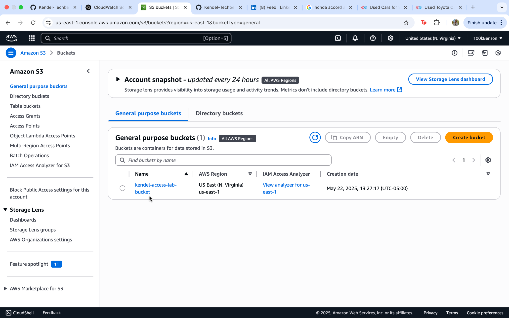
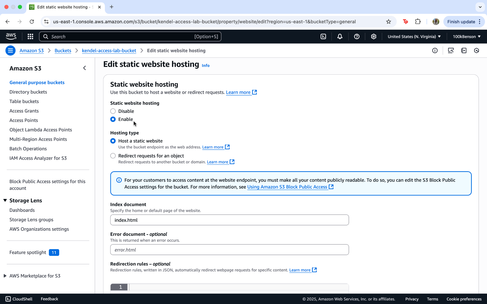
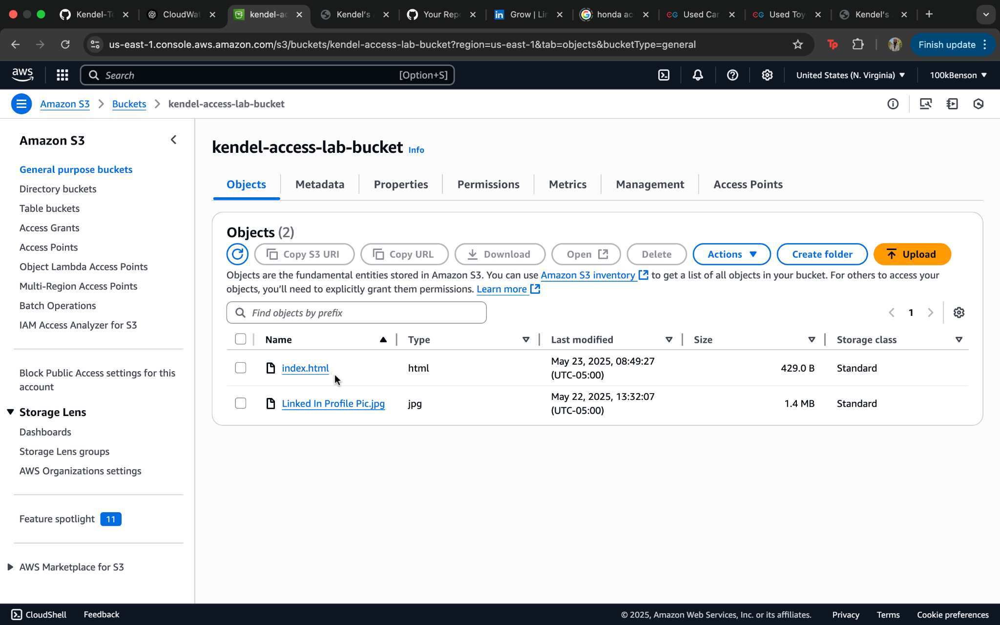
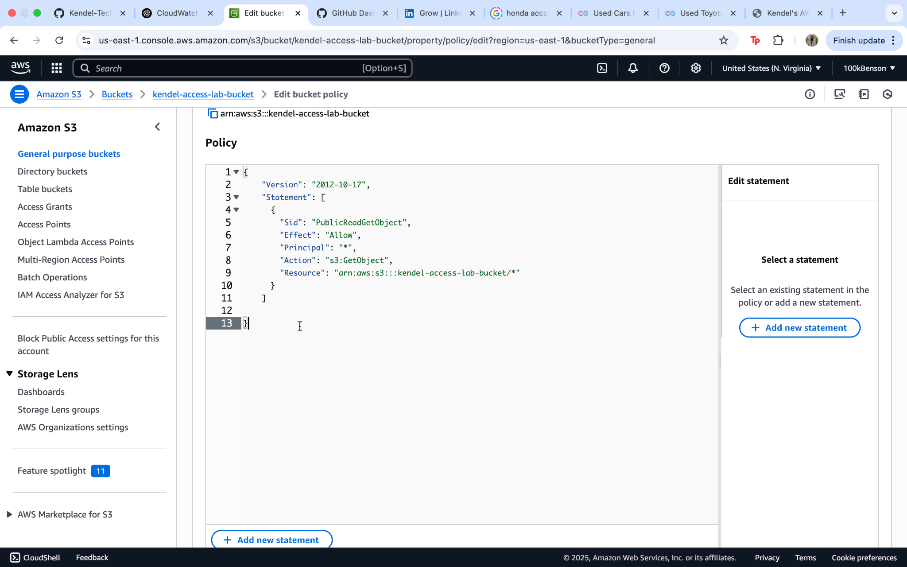
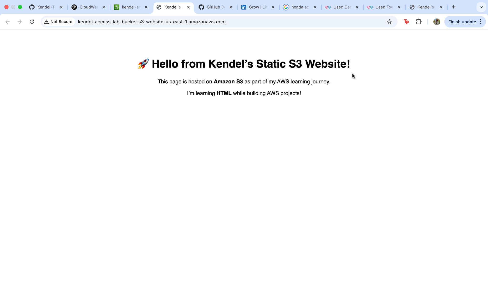
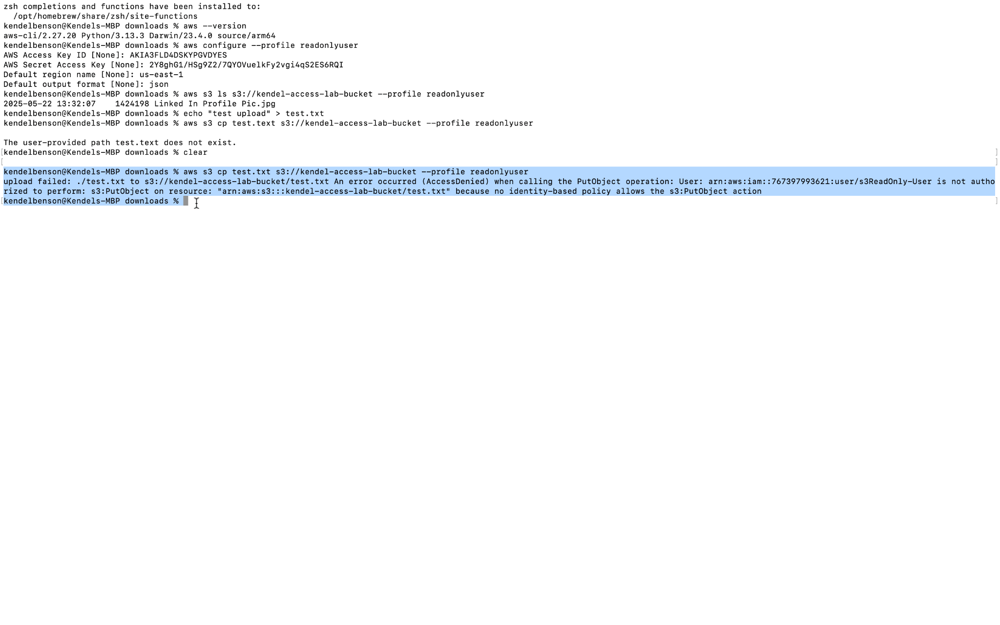
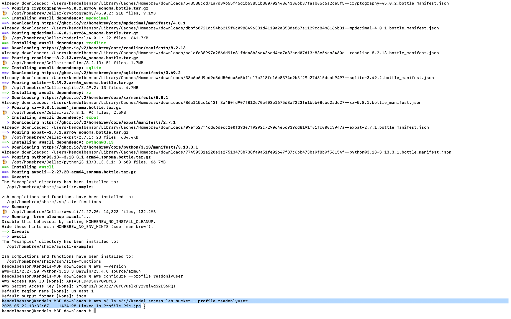
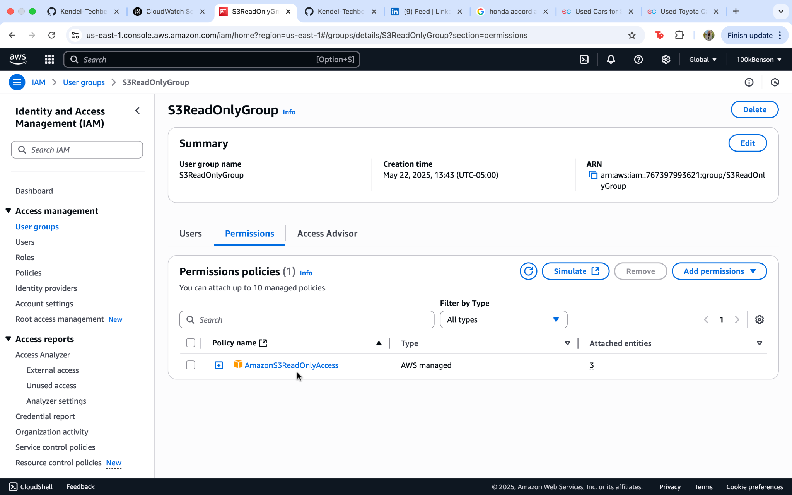
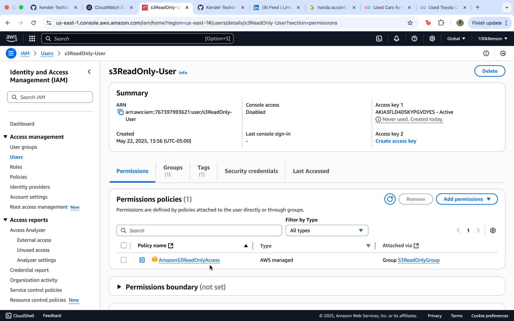
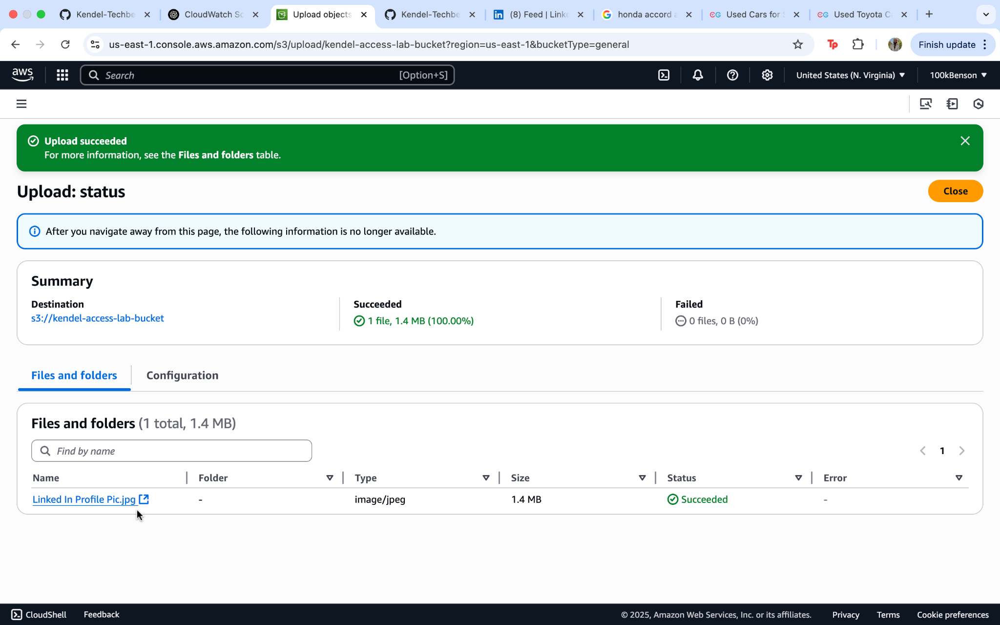

# AWS S3 Static Website Hosting Lab

## 📄 Summary
This project demonstrates how to host a static website using Amazon S3. The lab walks through creating a bucket, configuring it for static hosting, uploading a sample HTML file, managing permissions with IAM, and verifying access control using read-only roles.

---

## 🛠️ What I Did (Step-by-Step)

1. **Created an S3 Bucket**
2. **Enabled Static Website Hosting**
3. **Uploaded `index.html` to the bucket**
4. **Set a Bucket Policy for Public Access**
5. **Verified the Website was Live**
6. **Simulated Upload Denied using IAM ReadOnlyUser**
7. **Updated IAM Group Permissions to Allow Upload**
8. **Verified Upload Succeeds with Correct Policy**
9. **Created IAM Group and User with Read-Only Permissions**
10. **Tested Access and Verified Results**

---

## 🖼️ Screenshots and Descriptions

| Step | Screenshot | Description |
|------|------------|-------------|
| 1 |  | S3 bucket created |
| 2 |  | Enabled static website hosting |
| 3 |  | Uploaded HTML file |
| 4 |  | Configured bucket policy for public access |
| 5 |  | Verified site is publicly accessible |
| 6 |  | Upload denied without write permissions |
| 7 |  | Upload succeeded after fixing permissions |
| 8 |  | IAM group with read-only policy |
| 9 |  | IAM user created |
| 10 |  | Verified file uploaded by IAM user |

---

## 🧠 Skills Demonstrated

- S3 bucket setup & static hosting configuration
- Writing bucket policies for public access
- IAM group & user creation
- IAM permission testing (read-only vs write access)
- AWS CLI for access simulation
- HTML deployment in the cloud

---

## 🔔 Notifications

- Bucket names must be **globally unique**
- Public access requires correctly configured policies
- IAM role testing ensures security best practices

---

## 🔗 S3 Website URL

**[*](https://kendel-access-lab-bucket.s3.us-east-1.amazonaws.com/index.html)*
